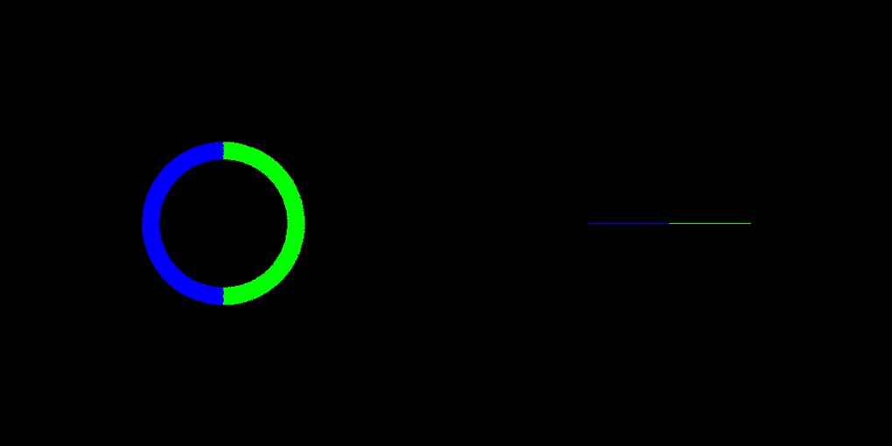
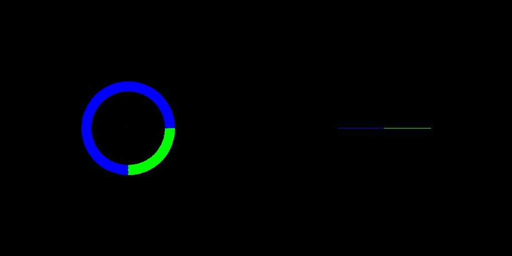

# milupHPC

**High Performance Computing Smooth(ed) Particle Hydrodynamics**

The successor of [miluphcuda](https://github.com/christophmschaefer/miluphcuda) targeting GPU cluster via CUDA aware MPI.

## Current status

**Principally working, but not (fully) implemented yet!**

* one GPU


* two GPUs (lebesgue curve)


* two GPUs (hilbert curve)



* two GPUs unequal load distribution (hilbert curve)




* See [MichaelSt98/SPH](https://github.com/MichaelSt98/SPH) for a proof of concept

## Usage 

* **compile** using the *Makefile* via: `make`
	* for debug: `make debug`
		* using *cuda-gdb*: `./debug/cuda_debug.sh`
	* for single-precision: `make single-precision` (default: double-precision)
* **run** via: `mpirun -np <number of processes> ./bin/runner`
* clean via: `make clean`, `make cleaner`
* rebuild via: `make remake` 	 

### Command line arguments

* `./bin/runner -h` gives help:

```
Multi-GPU CUDA Barnes-Hut NBody code
Usage:
  HPC NBody [OPTION...]

  -i, --iterations arg          number of iterations (default: 100)
  -t, --timestep arg            time step (default: 0.001)
  -l, --loadbalancing           load balancing
  -L, --loadbalancinginterval arg
                                load balancing interval (default: 10)
  -c, --curvetype arg           curve type (Lebesgue: 0/Hilbert: 1) 
                                (default: 0)
  -h, --help                    Show this help

```