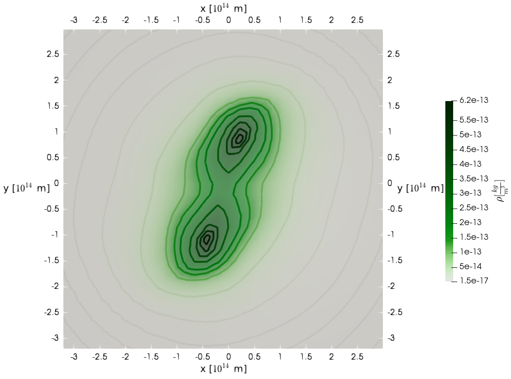

# milupHPC

**High Performance Computing Smooth(ed) Particle Hydrodynamics**

The successor of [miluphcuda](https://github.com/christophmschaefer/miluphcuda) targeting GPU cluster via CUDA aware MPI.

_______

This repository implements a **multi-GPU SPH & N-body (via Barnes-Hut) algorithm using C++11 and CUDA-aware MPI** by combining already proven parallelization strategies and available implementations 

* **Single-GPU version inspired/adopted from:**
	* [Miluphcuda](https://github.com/christophmschaefer/miluphcuda) 
	* [An Efficient CUDA Implementation of the Tree-Based Barnes Hut n-Body Algorithm](https://iss.oden.utexas.edu/Publications/Papers/burtscher11.pdf)
* **Multi-Node (or rather Multi-CPU) version inspired/adopted from:**
	* M. Griebel, S. Knapek, and G. Zumbusch. Numerical Simulation in Molecular Dynamics: Numerics, Algorithms, Parallelization, Applications. 1st. Springer Pub- lishing Company, Incorporated, 2010. isbn: 3642087760

with new ideas and parallelization strategies.

* for a **versatile single-GPU implementation** refer to [miluphcuda](https://github.com/christophmschaefer/miluphcuda) 
* for a **multi-CPU implementation** (self-gravity via Barnes-Hut only) refer to [jammartin/ParaLoBstar](https://github.com/jammartin/ParaLoBstar)

_______

## Parallelization/Implementation

* Parallelization embraces both 
	* **multi-node** parallelization via message-passing and 
	* **single-node** parallelization for **GPU**s via CUDA

implemented using **C++ and CUDA-aware MPI**.


<details>
 <summary>
   **Implementation details**
 </summary>

```c
include/src
├── cuda_utils // CUDA utilities
│   ├── cuda_launcher.cuh/cu
│   ├── cuda_runtime.h/cpp
│   ├── cuda_utilities.cuh/cu
│   └── linalg.cuh/cu
├── device_rhs.cuh/cu
├── gravity // Gravity related functions/kernels
│   └── gravity.cuh/cu
├── helper.cuh/cu // buffer class
├── helper_handler.h/cpp // buffer handling
├── integrator // Integrator classes, inheriting from miluphpc.h/cpp
│   ├── device_explicit_euler.cuh/cu
│   ├── device_leapfrog.cuh/cu
│   ├── device_predictor_corrector_euler.cuh/cu
│   ├── explicit_euler.h/cpp
│   ├── leapfrog.h/cpp
│   └── predictor_corrector_euler.h/cpp
├── main.cpp // main
├── materials // material handling (for SPH)
│   ├── material.cuh/cu
│   └── material_handler.cuh/cpp
├── miluphpc.h/cpp // base class for dispatching simulation
├── particle_handler.h/cpp // particle class handling
├── particles.cuh/cu // particle information/class
├── processing
│   └── kernels.cuh/cu
├── simulation_time.cuh/cu // simulation time class
├── simulation_time_handler.cpp // simulation time handling
├── sph // SPH related functions/kernels
│   ├── density.cuh/cu
│   ├── internal_forces.cuh/cu
│   ├── kernel.cuh/cu
│   ├── kernel_handler.cuh/cu
│   ├── pressure.cuh/cu
│   ├── soundspeed.cuh/cu
│   ├── sph.cuh/cu
│   ├── stress.cuh/cu
│   └── viscosity.cuh/cu
├── subdomain_key_tree // Tree related functions/kernels as well as domain decomposition
│   ├── subdomain.cuh/cu
│   ├── subdomain_handler.h/cpp
│   ├── tree.cuh/cu
│   └── tree_handler.h/cpp
└── utils // C++ utilities
    ├── config_parser.h/cpp
    ├── h5profiler.h/cpp
    ├── logger.h/cpp
    └── timer.h/cpp
```

The actual implementation and dispatching of the simulation includes 

* pre-processing (inititial particle distribution, ...)
* preparation tasks like 
	* initializing the MPI and CUDA environment
	* reading the initial particle distribution
	* memory allocation, ...
* the actual simulation in dependence of the used integration scheme
	* encapsulated in the right-hand-side (as depicted in the following picture)  
	* advancing the particles
* post-processing
* ...

However, as the following suggests, the simulation differs for single and multi-node execution, whereas multi-node execution requires more and more sophisticated functionalities to ensure the correctness of the algorithms.


</details>


## Prerequisites/Dependencies

For more information and instructions refer to [Prerequisites.md](documents/Prerequisites.md)

| library         | licence           | usage             | link               |
| --------------- | ----------------- | ----------------- | ------------------ |
| GNU             | GPLv3+            | compiler          | [gnu.org](https://www.gnu.org/home.de.html) |
| OpenMPI         | BSD 3-Clause      | compiler, MPI Implementation | [open-mpi.org](https://www.open-mpi.org/) |
| CUDA            | CUDA Toolkit End User License Agreement | compiler, CUDA Toolkit and API | [developer.nvidia.com](https://developer.nvidia.com/) |
| CUDA cub        | BSD 3-Clause "New" or "Revised" License | device wide parallel primitives | [github.com/NVIDIA/cub](https://github.com/NVIDIA/cub) |
| HDF5            | HDF5 License (BSD-Style) | parallel HDF5 for I/O operations | [hdf5group.org](https://www.hdfgroup.org/solutions/hdf5/) |
| HighFive        | Boost Software License 1.0 | C++ wrapper for parallel HDF5 | [github.com/BlueBrain/HighFive](https://github.com/BlueBrain/HighFive) |
| Boost           | Boost Software License 1.0 | config file parsing, C++ wrapper for MPI | [boost.org](https://www.boost.org/) |
| cxxopts         | MIT license | command line argument parsing | [github.com/jarro2783/cxxopts](https://github.com/jarro2783/cxxopts) |
| libconfig       |  LGPL-2.1 | material config parsing| [github.io/libconfig](http://hyperrealm.github.io/libconfig/) |

* in general there is no need for the usage of the GNU compiler and OpenMPI as MPI implementation, as long as a proper C++ compiler as well as MPI implementation (CUDA-aware) are available and corresponding changes in the Makefile are done


## Usage 


* you need to provide an appropriate H5 file as initial (particle) distribution 
	* see e.g. [GitHub: ParticleDistributor](https://github.com/MichaelSt98/ParticleDistributor)


* **build/compile** using the *Makefile* via: `make`
	* for debug: `make debug`
		* using *cuda-gdb*: `./debug/cuda_debug.sh`
	* for single-precision: `make single-precision` (default: double-precision)
* **run** via **`mpirun -np <np> <binary> -n <#output files> -f <input hdf5 file> -C <config file> -m <material-config>`**
	* `<binary>` within `bin/` e.g. `bin/runner` 
	* `<input hdf5 file>`: appropriate HDF5 file as initial (particle) distribution 
	* `<config file>`: configurations
	* `<material-config>` : material configurations
	* as well as correct preprocessor directives: `include/parameter.h`
* clean via: `make clean`, `make cleaner`
* rebuild via: `make remake` 	

<details>
 <summary>
   **Preprocessor directives: parameter.h**
 </summary>

* see `include/parameter.h`

```c
#define DEBUGGING 0

/**
 * * `SAFETY_LEVEL 0`: almost no safety measures
 * * `SAFETY_LEVEL 1`: most relevant/important safety measures
 * * `SAFETY_LEVEL 2`: more safety measures, including assertions
 * * `SAFETY_LEVEL 3`: many security measures, including all assertions
 */
#define SAFETY_LEVEL 2

/// Dimension of the problem
#define DIM 3

/// [0]: natural units, [1]: SI units
#define SI_UNITS 1

/// [0]: rectangular (and not necessarily cubic domains), [1]: cubic domains
#define CUBIC_DOMAINS 1

/// Simulation with gravitational forces
#define GRAVITY_SIM 1

/// SPH simulation
#define SPH_SIM 1

/// integrate energy equation
#define INTEGRATE_ENERGY 0

/// integrate density equation
#define INTEGRATE_DENSITY 1

/// integrate smoothing length
#define INTEGRATE_SML 0

/// decouple smoothing length for pc integrator(s)
#define DECOUPLE_SML 0

/// variable smoothing length
#define VARIABLE_SML 1

/// correct smoothing length
#define SML_CORRECTION 0

/**
 * Choose the SPH representation to solve the momentum and energy equation:
 * * **SPH_EQU_VERSION 1:** original version with
 *     * HYDRO $dv_a/dt ~ - (p_a/rho_a**2 + p_b/rho_b**2)  \nabla_a W_ab$
 *     * SOLID $dv_a/dt ~ (sigma_a/rho_a**2 + sigma_b/rho_b**2) \nabla_a W_ab$
 * * **SPH_EQU_VERSION 2:** slighty different version with
 *     * HYDRO $dv_a/dt ~ - (p_a+p_b)/(rho_a*rho_b)  \nabla_a W_ab$
 *     * SOLID $dv_a/dt ~ (sigma_a+sigma_b)/(rho_a*rho_b)  \nabla_a W_ab$
 */
#define SPH_EQU_VERSION 1
```
</details>


<details>
 <summary>
   **Input HDF5 file**
 </summary>
 
* for **gravity only**
	* provide mass "m", position "x" and velocity "v" 

```
GROUP "/" {
   DATASET "m" {
      DATATYPE  H5T_IEEE_F64LE
      DATASPACE  SIMPLE { ( <num particles> ) / ( <num particles>  ) }
   }
   DATASET "v" {
      DATATYPE  H5T_IEEE_F64LE
      DATASPACE  SIMPLE { ( <num particles> , <dim> ) / ( <num particles> , <dim> ) }
   }
   DATASET "x" {
      DATATYPE  H5T_IEEE_F64LE
      DATASPACE  SIMPLE { ( <num particles> , <dim>  ) / (<num particles> , <dim>  ) }
   }
}
}
```

* **with SPH** provide (at least)
	* provide mass "m", material identifier "materialId", internal energy "u", position "x" and velocity "v" 

```
GROUP "/" {
   DATASET "m" {
      DATATYPE  H5T_IEEE_F64LE
      DATASPACE  SIMPLE { ( <num particles> ) / ( <num particles>  ) }
   }
   DATASET "materialId" {
      DATATYPE  H5T_STD_I8LE
      DATASPACE  SIMPLE { ( <num particles>  ) / ( <num particles>  ) }
   }
   DATASET "u" {
      DATATYPE  H5T_IEEE_F64LE
      DATASPACE  SIMPLE { ( <num particles>  ) / ( <num particles>  ) }
   }
   DATASET "v" {
      DATATYPE  H5T_IEEE_F64LE
      DATASPACE  SIMPLE { ( <num particles> , <dim> ) / ( <num particles> , <dim> ) }
   }
   DATASET "x" {
      DATATYPE  H5T_IEEE_F64LE
      DATASPACE  SIMPLE { ( <num particles> , <dim>  ) / (<num particles> , <dim>  ) }
   }
}
}
```
 
</details>


<details>
 <summary>
   **Config file**
 </summary>
 
```
; IO RELATED
; ------------------------------------------------------
; output directory (will be created if it does not exist)
directory bb/

; outputRank (-1 corresponds to all)
outputRank -1
; omit logType::TIME for standard output
omitTime true
; create log file (including warnings, errors, ...)
log true
; create performance log
performanceLog true
; write particles to be sent to h5 file
particlesSent2H5 true


; INTEGRATOR RELATED
; ------------------------------------------------------
; integrator selection
; explicit euler [0], predictor-corrector euler [1], leapfrog [2]
integrator 1
; initial time step
timeStep 1e-4
; max time step allowed
maxTimeStep 1e-4
; end time for simulation
;timeEnd 6e-2

; SIMULATION RELATED
; ------------------------------------------------------
; space-filling curve selection
; lebesgue [0], hilbert [1]
sfc 1

; theta-criterion for Barnes-Hut (approximative gravity)
theta 0.5
; smoothing parameter for gravitational forces
smoothing 2.56e+20

; SPH smoothing kernel selection
; spiky [0], cubic spline [1], wendlandc2 [3], wendlandc4 [4], wendlandc6 [5]
smoothingKernel 1

; remove particles (corresponding to some criterion)
removeParticles true
; spherically [0], cubic [1]
removeParticlesCriterion 0
; allowed distance to center (0, 0, 0)
removeParticlesDimension 3.6e14

; execute load balancing
loadBalancing false
; interval for executing load balancing (every Nth step)
loadBalancingInterval 1

; how much memory to allocate (1.0 -> all particles can in principle be on one process)
particleMemoryContingent 1.0

; calculate angular momentum (and save to output file)
calculateAngularMomentum true
; calculate (total) energy (and save to output file)
calculateEnergy true
; calculate center of mass (and save to output file)
calculateCenterOfMass false

; IMPLEMENTATION SELECTION
; ------------------------------------------------------
; force version for gravity (use [2])
; burtscher [0], burtscher without presorting [1], miluphcuda with presorting [2],
; miluphcuda without presorting [3], miluphcuda shared memory (experimental) [4]
gravityForceVersion 0
; fixed radius NN version for SPH (use [0])
; normal [0], brute-force [1], shared-memory [2], within-box [3]
sphFixedRadiusNNVersion 3
```

</details>


<details>
 <summary>
   **Material config file**
 </summary>
 
```
materials = (
{
    ID = 0
    name = "IsothermalGas"
    #sml = 1e12
    sml = 5.2e11
    interactions = 50
    artificial_viscosity = { alpha = 1.0; beta = 2.0; };
    eos = {
        type = 3
    };
}
);

...
```
 
</details>


## Samples/Validation


The code validation comprises the correctness of dispatched simulation on one GPU and multiple GPUs, whereas identical simulation on one and multiple GPUs are not mandatorily bitwise-identical. By suitable choice of compiler flags and in dependence of the used architecture this is in principle attainable. However, this is generally not useful to apply for performance reasons and therefore at this point not presupposed. Amongst others, three test cases were used for validating the implementation:

* the Plummer test case is a gravity-only test case
* the Taylor–von Neumann–Sedov blast wave test case is a pure hydrodynamical SPH test case 
* the isothermal collapse test case  self-gravitating SPH test case utilizing almost all implemented features

> each color represents a process, thus a GPU

<details>
 <summary>
   **Plummer**
 </summary>

* Plummer model: four GPUs with dynamic load balancing every 10th step (top: lebesgue, bottom: hilbert)


The Plummer model is a gravity only test case, the distribution is stable over time enabling the validation as shown in the following picture.


</details>


<details>
 <summary>
   **Taylor–von Neumann–Sedov blast wave**
 </summary>

* Sedov explosion: one and two GPUs


The density in dependence of the radius for t = 0.06 and the semi-analytical solution as comparison.


</details>


<details>
 <summary>
   **Boss-Bodenheimer: Isothermal collapse**
 </summary>

* Boss-Bodenheimer: isothermal collapse
	* one and two GPUs 


Contour plot, showing the density at 1.2 x free-fall time.



</details>


