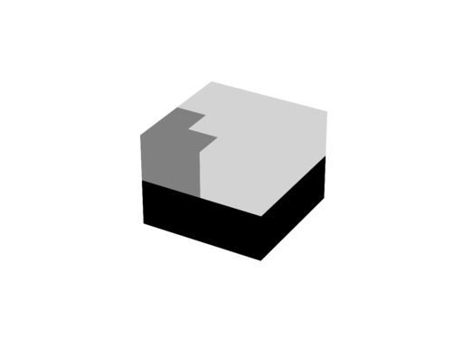

# Postprocessing

Python scripts for postprocessing, visualization, ...

## Content

### [VisualizeDistribution.py](VisualizeDistribution.py)

* visualize a particle distribution with Matplotlib 3D

### [VisualizeDomains_2D.py](VisualizeDomains_2D.py)

* visualize domain borders or rather domains for 2D simulations

### [VisualizeDomains_3D.py](VisualizeDomains_3D.py)

* visualize domain borders or rather domains for 3D simulations

